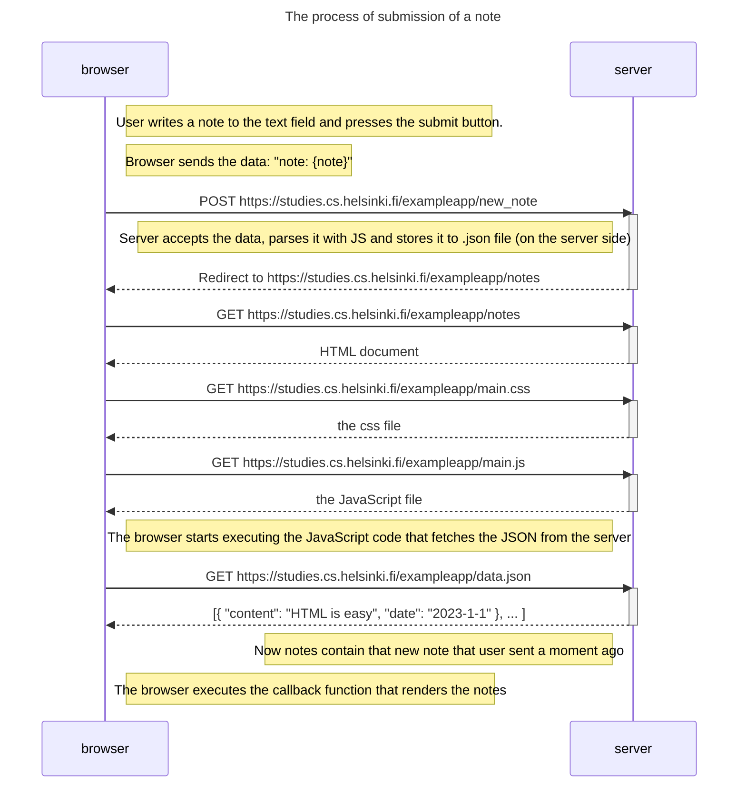

```mermaid
---
title: The process of submission of a note
---

sequenceDiagram
    
    participant browser
    participant server

    Note right of browser: User writes a note to the text field and presses the submit button.
    Note right of browser: Browser sends the data: "note: {note}"


    browser->>server: POST https://studies.cs.helsinki.fi/exampleapp/new_note
    activate server

    Note left of server: Server accepts the data, parses it with JS and stores it to .json file (on the server side)

    server-->>browser: Redirect to https://studies.cs.helsinki.fi/exampleapp/notes

    deactivate server
    
    browser->>server: GET https://studies.cs.helsinki.fi/exampleapp/notes
    activate server
    server-->>browser: HTML document
    deactivate server
    
    browser->>server: GET https://studies.cs.helsinki.fi/exampleapp/main.css
    activate server
    server-->>browser: the css file
    deactivate server
    
    browser->>server: GET https://studies.cs.helsinki.fi/exampleapp/main.js
    activate server
    server-->>browser: the JavaScript file
    deactivate server
    
    Note right of browser: The browser starts executing the JavaScript code that fetches the JSON from the server
    
    browser->>server: GET https://studies.cs.helsinki.fi/exampleapp/data.json
    activate server
    server-->>browser: [{ "content": "HTML is easy", "date": "2023-1-1" }, ... ]
    deactivate server    

    Note left of server: Now notes contain that new note that user sent a moment ago
    Note right of browser: The browser executes the callback function that renders the notes 
```