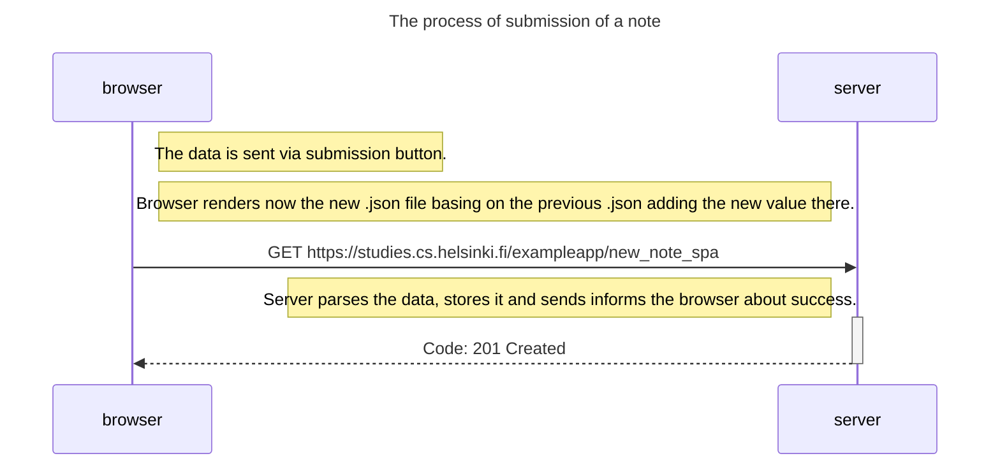

```mermaid
---
title: The process of submission of a note
---

sequenceDiagram
    
    participant browser
    participant server

    Note right of browser: The data is sent via submission button.

    Note right of browser: Browser renders now the new .json file basing on the previous .json adding the new value there.
    browser->>server: GET https://studies.cs.helsinki.fi/exampleapp/new_note_spa

    Note left of server: Server parses the data, stores it and sends informs the browser about success.

    activate server
    server-->>browser: Code: 201 Created
    deactivate server
    
```